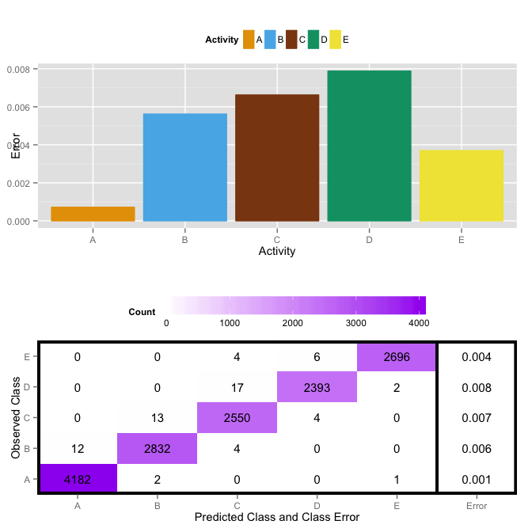
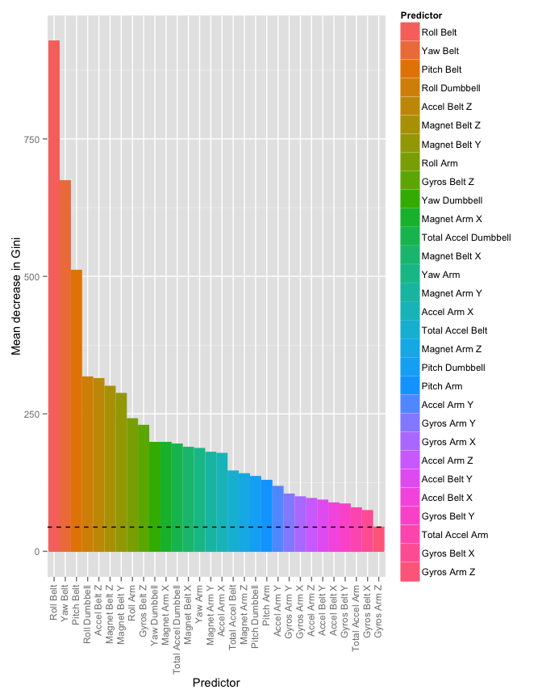

# Weight Lifting Exercises
Cristofer Weber  
February 21, 2015  


## Summary
Six young health participants were asked to perform one set of 10 repetitions of the Unilateral Dumbbell Biceps Curl in five different fashions: exactly according to the specification (Class A), throwing the elbows to the front (Class B), lifting the dumbbell only halfway (Class C), lowering the dumbbell only halfway (Class D) and throwing the hips to the front (Class E). [@Velloso:2013:QAR:2459236.2459256]

As shown in the picture below, three sets of sensors were placed in different parts of the body using a Belt, a Glove and an Armband. Another set of sensors was placed in the Dumbbell. Each set of sensors has an Accelerometer, a Gyroscope and a Mgnetomete, and the collected metrics are the tridimentional raw data (X, Y and Z) from each sensor. Each measurement also has the calculated Euler angles:  Roll, Pitch and Yaw. All these metrics were recorded together with the activities (Classe), participant data, timestamps and other statistics.


More details of the experiment available at: http://groupware.les.inf.puc-rio.br/har#weight_lifting_exercises#ixzz3SObtcRBO

Participants of the class were asked to train a classifier able to identify the performed activity based on the recorded metrics, provided a training file and a test file. As part of the assignment, the test file is for evaluation only, so it can't be used during the training process. So I splitted the training file in two different sets, where the new train set is 75% of the original training file and the test set is 25% of the original training file, as below:


```r
set.seed(1234)
train = createDataPartition(activities$classe, p=0.75, list=F)
trainingActivities = activities[train,]
testingActivities = activities[-train,]
```

## Feature Selection and Preprocessing
### Empty values


Feature selection was performed in the new train set. As mentioned before, there are 8 statistics calculated per exercise repetition. Each of these statistical measures is blank most of the time, so I chose to drop every measure that matches one of the following names:
Kurtosis, Skewness, Max, Min, Amplitude, Var, Avg, Stddev

A total of 100 measures were removed in this step.

### Unrelated Columns

From the remaining fields I also removed those that identify the participants, the repetitions, and the time windows:


Unrelated              Unrelated            
---------------------  ---------------------
X                      user_name            
raw_timestamp_part_1   raw_timestamp_part_2 
cvtd_timestamp         new_window           
num_window                                  

## Training

My learning method of choice was Random Forests. The model was trained using as predictors all raw and calculates measures collected during the activities, as below. 


```r
mForest = randomForest(y=trainingActivities$classe, x=trainingActivities[, -53], ntree=500, replace=T)
```

Here is the Training Classification Error per class, together with the Training Confusion Matrix.



Another important metric from Random Forests is the Variable Importance, here presented using Gini, measuring the redution in Classification Error caused by the inclusion of each predictor, limited to the 30 most important predictors.




## Out of Sample Accuracy

```r
cMatrix = confusionMatrix(testingActivities$classe, predict(mForest, testingActivities[, -53]))

# Out of Sample Accuracy
Accuracy = round(cMatrix$overall[1], 4)

# 95% Confidence Interval
ConfInt = round(cMatrix$overall[c(3, 4)], 4)
```

The accuracy measured using the reserved testing set is 0.9953, with a 95% Confidence Interval of (0.993, 0.997).

Below I present the Balanced Accuracy per Class, plus the measures of Sensitivity and Specificity.


            Sensitivity    Specificity    Balanced Accuracy 
---------  -------------  -------------  -------------------
Class: A      0.9993         1.0000            0.9996       
Class: B      0.9885         0.9992            0.9939       
Class: C      0.9883         0.9970            0.9927       
Class: D      0.9987         0.9981            0.9984       
Class: E      1.0000         1.0000            1.0000       

## Assignment Test Submission

Finally, here is the code to predict the answers for the Assignment Test Submission.


```r
testActivities = read.csv("data/pml-testing.csv", header=T, comment.char="", quote="\"", col.names = activitiesNames)
# Drop all unwanted/unimportant columns
testActivities = testActivities[, -unwantedColumns]
testActivities = testActivities[, -which(names(testActivities) %in% otherUnwantedCols)]

answers = predict(mForest, testActivities[, -53])
```

## References
